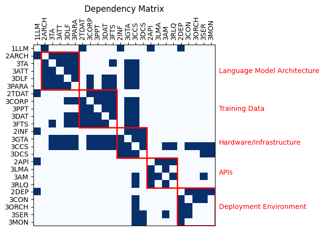
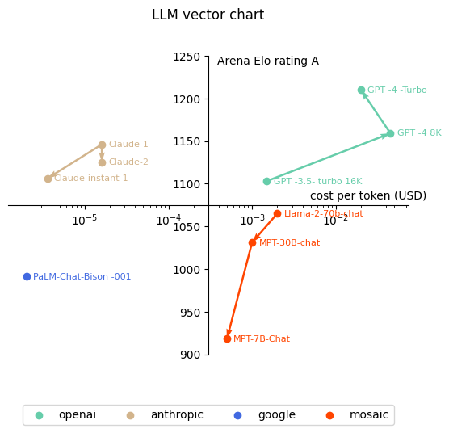

# Large Language Models (LLMs) Technology Roadmap

---

### 1. Roadmap Overview

Large Language Models (LLMs) have become a cornerstone in the field of artificial intelligence, offering unprecedented capabilities in natural language processing. These models are capable of understanding, generating, and translating human language with remarkable accuracy. The roadmap for LLMs encompasses the development of models that are not only powerful in terms of parameter count but also efficient, cost-effective, and environmentally conscious.

The LLM technology roadmap aims to guide the development of models that can serve a wide array of applications, from conversational AI to content generation and beyond. It will address the challenges of accuracy, bias, perishability, and the need for sovereign LLMs that cater to local languages and cultures.

### 2. Design Structure Matrix (DSM) Allocation

The DSM for LLMs identifies the key technologies and their interdependencies. At the core are the LLMs themselves, which rely on advanced neural network architectures, vast training datasets, and robust computational infrastructure. The DSM also highlights the relationship between LLMs and auxiliary technologies such as GPUs, cloud services, and data security mechanisms.

Certainly! Here is the provided table converted to Markdown format:

| Shortname | Level | Technology                       | Technology Description                                            |
|-----------|-------|----------------------------------|-------------------------------------------------------------------|
| 1LLM      | 1     | Large Language Models             | LLMs are a type of artificial intelligence model designed to understand and generate human-like language.                     |
| 2ARCH     | 1.1   | Language Model Architecture       | The core model architecture and parameters.                        |
| 3TA       | 1.1.1 | Transformer Architecture          | The fundamental architecture underlying models like GPT-3.         |
| 3ATT      | 1.1.2 | Attention Mechanism               | Key component within the transformer architecture.                 |
| 3DLF      | 1.1.3 | Deep Learning Frameworks          | TensorFlow, PyTorch, or others used to implement the architecture. |
| 3PARA     | 1.1.4 | Model Parameters                  | Weights and biases that define the specifics of the model.         |
| 2TDAT     | 1.2   | Training Data                     | The datasets used to pre-train and fine-tune the language model.   |
| 3CORP     | 1.2.1 | Corpora                            | Diverse datasets from various sources, such as books, articles, and websites. |
| 3PPT      | 1.2.2 | Pre-processing Tools               | Software for cleaning, tokenizing, and formatting the training data. |
| 3DAT      | 1.2.3 | Data Augmentation Techniques       | Methods to increase dataset diversity without collecting new data. |
| 3FTS      | 1.2.4 | Fine-tuning Strategies             | Approaches to adapt the pre-trained model to specific tasks.       |
| 2INF      | 1.3   | Hardware/Infrastructure           | The computational resources used for training and deployment.      |
| 3GTA      | 1.3.1 | GPU/TPU Acceleration              | Graphics Processing Units (GPUs) or Tensor Processing Units (TPUs) for faster training. |
| 3CCS      | 1.3.2 | Cloud Computing Services           | Platforms like AWS, Azure, or Google Cloud used for scalable resources. |
| 3DCS      | 1.3.3 | Distributed Computing              | Techniques to parallelize training across multiple machines.      |
| 2API      | 1.4   | APIs                             | If the language model is used as a service, understanding the API and its dependencies. |
| 3LMA      | 1.4.1 | Language Model API                | The API exposed by the LLM for interaction.                       |
| 3AM       | 1.4.2 | Authentication Mechanisms         | Security measures for accessing the API.                          |
| 3RLQ      | 1.4.3 | Rate Limiting and Quotas           | Controls on API usage to manage resources.                         |
| 2DEP      | 1.5   | Deployment Environment            | The system or platform where the LLM is deployed.                 |
| 3CON      | 1.5.1 | Containerization                  | Technologies like Docker for packaging the LLM and its dependencies. |
| 3ORCH     | 1.5.2 | Orchestration Tools                | Kubernetes for automating the deployment, scaling, and management of containerized applications. |
| 3SER      | 1.5.3 | Serverless Computing               | Frameworks like AWS Lambda or Azure Functions for deploying code without managing infrastructure. |
| 3MON      | 1.5.4 | Monitoring and Logging Tools       | Systems for tracking performance and diagnosing issues in the deployment. |

Let's organize the information into a Dependency Structure Matrix (DSM) based on the provided components and instructions:

#### 2.1 Interdependencies:

- **Interdependencies:**
  - 2ARCH depends on 3DLF (Deep Learning Frameworks) for implementation.
  - 3TA (Transformer Architecture) is a key component within 2ARCH.
  - 3TA relies on 3ATT (Attention Mechanism).
  - 2TDAT relies on 3CORP, 3PPT, 3DAT, and 3FTS for training data.
  - 2INF relies on 3GTA, 3CCS, and 3DCS for computational resources.
  - 2API relies on 3LMA, 3AM, and 3RLQ for API functionality.
  - 2DEP relies on 3CON, 3ORCH, 3SER, and 3MON for deployment.

#### 2.2 DSM Matrix:

**Figure 1:** This DSM can serve as a visual representation of the interdependencies within the LLM ecosystem, helping to identify areas of focus for co-investment and potential bottlenecks. Adjust the matrix as needed based on specific project requirements and details.

#### 2.3 Matrix Analysis:

- **Clusters of Interdependencies:**
  - **Cluster 1 (Model Architecture):** 2ARCH, 3TA, 3ATT, 3DLF, 3PARA
  - **Cluster 2 (Training Data):** 2TDAT, 3CORP, 3PPT, 3DAT, 3FTS
  - **Cluster 3 (Infrastructure):** 2INF, 3GTA, 3CCS, 3DCS
  - **Cluster 4 (APIs):** 2API, 3LMA, 3AM, 3RLQ
  - **Cluster 5 (Deployment):** 2DEP, 3CON, 3ORCH, 3SER, 3MON

#### 2.4 Key Relationships:

1. **Critical Training Data Dependencies:**
   - Highlight the strong dependencies between 2TDAT (Training Data) and its sub-components (3CORP, 3PPT, 3DAT, 3FTS). Emphasize the importance of diverse datasets (3CORP) and effective pre-processing tools (3PPT) for training data quality.

2. **GPU Acceleration for Efficient Training:**
   - Emphasize the critical role of GPU/TPU Acceleration (3GTA) for both 2ARCH (Model Architecture) and 2INF (Infrastructure). Efficient training heavily relies on the computational power provided by GPUs/TPUs.

3. **API Security Measures:**
   - Highlight the dependencies between 2API (API) and its security components (3LMA, 3AM). Stress the importance of secure authentication mechanisms (3AM) for the Language Model API (3LMA).

4. **Deployment Flexibility:**
   - Emphasize the flexibility of deployment environments (2DEP) with dependencies on Containerization (3CON), Orchestration Tools (3ORCH), Serverless Computing (3SER), and Monitoring/Logging Tools (3MON). This highlights the adaptability and scalability of the deployment.

5. **Model Architecture Foundation:**
   - Highlight the foundational role of 3TA (Transformer Architecture) within 2ARCH (Model Architecture). The architecture is fundamental to the overall design and functionality of the language model.

6. **Cloud Computing Resources:**
   - Emphasize the utilization of Cloud Computing Services (3CCS) in providing scalable resources for both 2INF (Infrastructure) and 2API (API). This highlights the cloud's role in supporting various components.

7. **Fine-Tuning Strategies for Model Adaptability:**
   - Emphasize the relationship between 3FTS (Fine-tuning Strategies) and 2TDAT (Training Data). Effective fine-tuning strategies depend on the quality and diversity of the training data.

8. **Orchestration for Automated Deployment:**
   - Highlight the role of Orchestration Tools (3ORCH), such as Kubernetes, in automating the deployment, scaling, and management of containerized applications (3CON). This relationship streamlines the deployment process.

9. **Monitoring and Logging for Performance Tracking:**
   - Emphasize the crucial role of Monitoring and Logging Tools (3MON) in tracking performance and diagnosing issues within the deployment environment (2DEP). This relationship ensures the reliability and performance of the deployed language model.

10. **API Rate Limiting and Quotas:**
    - Highlight the importance of Rate Limiting and Quotas (3RLQ) within 2API (API) to manage resources effectively and avoid abuse. This ensures the stability and fair usage of the language model API.

### 3. Roadmap Model using Object Process Methodology (OPM)

The OPM for LLMs illustrates the system's main components, including the training data, neural network architecture, and the output generation process. It also defines the roles of various stakeholders, such as researchers, developers, and end-users, and how they interact with the LLM system. 

The object process language (OPL) for Large Language Models (LLMs). OPL complements the Object Process Model (OPM).

| entity1                     | type 1  | state 1  | relation           | entity2                      | type 2  | state 2  |
| --------------------------- | ------- | -------- | ------------------ | ---------------------------- | ------- | -------- |
| Developers                  | object  | physical | requires           | API                          | object  | virtual  |
| Language Model Architecture | object  | virtual  | part of            | Attention Mechanism          | object  | virtual  |
| API                         | object  | virtual  | instrument handles | Authentication Mechanisms    | object  | virtual  |
| Pre-processing Tools        | object  | virtual  | instrument handles | Cleaning                     | process | virtual  |
| Deployment Environment      | object  | virtual  | part of            | Containerizing               | process | virtual  |
| Training Data               | object  | virtual  | requires           | Data Augmentation Techniques | object  | virtual  |
| Model                       | object  | virtual  | requires           | Deep Learning Framework      | object  | virtual  |
| Deployment Environment      | object  | virtual  | requires           | Developers                   | object  | physical |
| Model                       | object  | virtual  | requires           | Developers                   | object  | physical |
| Developers                  | object  | physical | agent handles      | System Integrating           | process | virtual  |
| Feedback                    | object  | virtual  | requires           | End-users                    | object  | physical |
| User Input                  | object  | virtual  | requires           | End-users                    | object  | physical |
| Model Evaluating            | process | virtual  | requires           | Feedback                     | object  | virtual  |
| Inferencing                 | process | virtual  | requires           | Fine-tuned Model             | object  | virtual  |
| Model Evaluating            | process | virtual  | requires           | Fine-tuned Model             | object  | virtual  |
| Fine-tuning                 | process | virtual  | results in         | Fine-tuned Model             | object  | virtual  |
| Fine-tuning                 | process | virtual  | requires           | Fine-tuning Data             | object  | virtual  |
| Pre-processing Tools        | object  | virtual  | instrument handles | Formatting                   | process | virtual  |
| GPU/TPU Acceleration        | object  | physical | relates to         | Hardware/Infrastructure      | object  | physical |
| Cloud Computing Services    | object  | virtual  | relates to         | Hardware/Infrastructure      | object  | physical |
| Distributed Computation     | object  | physical | relates to         | Hardware/Infrastructure      | object  | physical |
| Hardware/Infrastructure     | object  | physical | instrument handles | Training                     | process | virtual  |
| End-users                   | object  | physical | agent handles      | Inferencing                  | process | virtual  |
| Response                    | object  | virtual  | requires           | Inferencing                  | process | virtual  |
| API                         | object  | virtual  | instrument handles | Model                        | object  | virtual  |
| Training                    | process | virtual  | requires           | Language Model Architecture  | object  | virtual  |
| Fine-tuning                 | process | virtual  | requires           | Model                        | object  | virtual  |
| Evaluation Metrics          | object  | virtual  | requires           | Model Evaluating             | process | virtual  |
| Performance Tracking        | process | virtual  | requires           | Monitoring and Logging Tools | object  | virtual  |
| Deployment Environment      | object  | virtual  | requires           | Orchestration Tools          | object  | virtual  |
| Parameters                  | object  | virtual  | part of            | Model                        | object  | virtual  |
| Training                    | process | virtual  | results in         | Parameters                   | object  | virtual  |
| Training Data               | object  | virtual  | requires           | Pre-processing Tools         | object  | virtual  |
| API                         | object  | virtual  | instrument handles | Quota Limiting               | process | virtual  |
| API                         | object  | virtual  | instrument handles | Rate Limiting                | process | virtual  |
| Model Evaluating            | process | virtual  | requires           | Reference Data               | object  | virtual  |
| Language Model Architecture | object  | virtual  | requires           | Researchers                  | object  | physical |
| Training Techniques         | object  | virtual  | requires           | Researchers                  | object  | physical |
| Training                    | process | virtual  | requires           | Training Techniques          | object  | virtual  |
| API                         | object  | virtual  | relates to         | Deploying                    | process | virtual  |
| Training Data               | object  | virtual  | requires           | Text Corpus                  | object  | virtual  |
| Token Embeddings            | object  | virtual  | part of            | Model                        | object  | virtual  |
| Training                    | process | virtual  | results in         | Token Embeddings             | object  | virtual  |
| Pre-processing Tools        | object  | virtual  | instrument handles | Tokenizing                   | process | virtual  |
| Training                    | process | virtual  | requires           | Training Data                | object  | virtual  |
| Language Model Architecture | object  | virtual  | relates to         | Transformer Architecture     | object  | virtual  |
| Inferencing                 | process | virtual  | requires           | User Input                   | object  | virtual  |
| Text Corpus                 | object  | virtual  | relates to         | Words/Tokens                 | object  | virtual  |
| Training                    | process | virtual  | requires           | Words/Tokens                 | object  | virtual  |
| Vocabulary                  | object  | virtual  | relates to         | Words/Tokens                 | object  | virtual  |
| Attention Mechanism         | object  | virtual  | part of            | Deep Learning Framework      | object  | virtual  |
| Transformer Architecture    | object  | virtual  | part of            | Deep Learning Framework      | object  | virtual  |
| Deploying                   | process | virtual  | requires           | Deployment Environment       | object  | virtual  |
| Quota Limiting              | process | virtual  | part of            | Resource Managing            | process | virtual  |
| Rate Limiting               | process | virtual  | part of            | Resource Managing            | process | virtual  |
| Resource Managing           | process | virtual  | requires           | Monitoring and Logging Tools | object  | virtual  |
| Performance Tracking        | process | virtual  | part of            | Resource Managing            | process | virtual  |
| Training Data               | object  | virtual  | requires           | Tokenizing                   | process | virtual  |
| Training Data               | object  | virtual  | requires           | Formatting                   | process | virtual  |
| Training Data               | object  | virtual  | requires           | Cleaning                     | process | virtual  |
| Fine-tuning Data            | object  | virtual  | requires           | Tokenizing                   | process | virtual  |
| Fine-tuning Data            | object  | virtual  | requires           | Formatting                   | process | virtual  |
| Fine-tuning Data            | object  | virtual  | requires           | Cleaning                     | process | virtual  |

This extended OPM captures the essential components, relationships, and roles involved in the life cycle of Large Language Models.

### 4. Figures of Merit (FOM)

Key FOMs for LLMs include:

1. **Model Size (Parameters):**
   - **Units:** Count of parameters.
   - **Calculation:** Simply count the number of parameters in the model. For example, in a neural network, it would be the sum of the weights and biases in all layers.
   - **Additional Information:** Larger models often have more capacity for learning complex patterns but may also require more computational resources.

2. **Token Count:**
   - **Units:** Count of tokens.
   - **Calculation:** Sum the number of tokens in the input and output. Tokens can be words, subwords, or characters, depending on the model's architecture.
   - **Additional Information:** A higher token count generally indicates a larger language context that the model can understand and generate.

3. **Inference Speed:**
   - **Units:** Time per inference (e.g., seconds per inference).
   - **Calculation:** Measure the time it takes for the model to process an input and produce an output during inference.
   - **Additional Information:** Faster inference is crucial for real-time applications. It is influenced by hardware, model architecture, and optimization techniques.

4. **Training Cost:**
   - **Units:** Financial cost (e.g., dollars, euros).
   - **Calculation:** Sum of the costs associated with hardware, electricity, and human resources during the training process.
   - **Additional Information:** Training large models can be computationally expensive. Costs may include hardware infrastructure, electricity, and the salaries of the machine learning experts involved.

5. **Energy Efficiency:**
   - **Units:** Energy consumption per inference (e.g., joules per inference).
   - **Calculation:** Measure the energy consumed during inference and divide it by the number of inferences.
   - **Additional Information:** Energy-efficient models are important for sustainability. Improvements in hardware efficiency and model optimization contribute to energy efficiency.

6. **Bias Mitigation:**
   - **Units:** Effectiveness score (dimensionless).
   - **Calculation:** Evaluate the success of bias mitigation techniques using metrics such as fairness, balance, and representation.
   - **Additional Information:** Addressing biases in LLMs is critical for ethical and fair use. Techniques involve diverse training data, careful model design, and continuous monitoring.

7. **Inference Cost:**
   - **Units:** Financial cost per inference (e.g., dollars per inference).
   - **Calculation:** Divide the total cost of inference (including hardware, energy, and maintenance) by the number of inferences.
   - **Additional Information:** In some applications, especially those involving cloud services, the cost per inference is a critical factor. It considers both computational resources and energy usage during inference.

8. **Latency:**
   - **Units:** Time delay (e.g., milliseconds).
   - **Calculation:** Measure the time delay between submitting an input and receiving the corresponding output during inference.
   - **Additional Information:** Latency is crucial in real-time applications, and it's different from inference speed, as it includes network delays and other overhead.

9. **Robustness:**
   - **Units:** Robustness score (dimensionless).
   - **Calculation:** Assess the model's performance under different conditions, including adversarial attacks, noisy input, or variations in language use.
   - **Additional Information:** A robust model maintains performance across diverse scenarios, contributing to its reliability in real-world applications.

10. **Interpretability:**
    - **Units:** Interpretability score (dimensionless).
    - **Calculation:** Evaluate how easily humans can understand and interpret the model's decisions.
    - **Additional Information:** Interpretability is crucial for gaining insights into model behavior, ensuring trust, and identifying and addressing potential biases.

11. **Scalability:**
    - **Units:** Model performance as data size increases (dimensionless).
    - **Calculation:** Assess how well the model scales with an increase in the size of the input data.
    - **Additional Information:** Scalability is important for handling diverse and large datasets efficiently.

12. **Adaptability:**
    - **Units:** Adaptation score (dimensionless).
    - **Calculation:** Measure how well the model can adapt to new domains or changing data distributions.
    - **Additional Information:** Models that can adapt to evolving language use and new topics have extended utility over time.

13. **Perplexity:**

       - **Units:** Dimensionless.

       - **Calculation:** Perplexity is a measure of how well a probability distribution or probability model predicts a sample. For language models, perplexity is often used to evaluate how well the model predicts a sequence of words. It is calculated as the inverse probability of the test set, normalized by the number of words.

       - **Additional Information:** Lower perplexity values indicate better performance. Intuitively, perplexity can be thought of as a measure of uncertainty or surprise associated with a model's predictions.

14. **Elo Score for Language Models (LLMs):**

       - **Units:** Elo points.

       - **Calculation:** The Elo score for LLMs is determined through a competitive ranking system, similar to its application in chess. Models start with an initial Elo rating, and after each competition (e.g., in language generation tasks), their ratings are adjusted based on the outcome. If a model performs better than expected, its Elo rating increases, and vice versa. The adjustment is influenced by the Elo ratings of the competing models.

       - **Additional Information:** The Elo score provides a relative measure of a language model's performance compared to other models in a competitive setting. Higher Elo scores indicate better relative performance.

These  metrics provide a  comprehensive view of the capabilities, limitations, and practical considerations associated with large language models. The choice of which metrics to prioritize may depend on the specific use case and application requirements. Keep in mind that these figures of merit are interconnected, and optimizing one may have trade-offs with others. For instance, reducing model size may improve inference speed but might impact token count and potentially bias mitigation. Therefore, a comprehensive evaluation is crucial for assessing the overall performance of large language models.

#### Evolution of Technology

In the ever-evolving landscape of LLMs, the pursuit of optimal model architectures has become a focal point in Natural Language Processing (NLP). The models are characterized by billions of parameters. However, the quest for efficiency and scalability has prompted researchers to investigate the impact of model size on performance, giving rise to a critical discussion on the figures of merit for LLMs.

The need to optimize the size of language models is underscored by a compelling trade-off between model scale and performance. Traditionally, larger models have demonstrated superior capabilities in capturing intricate linguistic nuances, resulting in state-of-the-art (SOTA) performances across standard tests. Nonetheless, the escalation in model size comes at the cost of computational resources, prompting a reevaluation of the efficiency of smaller-scale models.

An intriguing revelation surfaces when examining the performance of models based on their parameter count. A figure suggests that models with fewer than 1 billion parameters struggle to surpass a 30% performance threshold across standard tests. This apparent limitation highlights the challenge faced by smaller models in grasping the intricacies of language tasks, thereby emphasizing the crucial role played by model size in achieving proficiency.

Contrastingly, as model size expands to around 10 billion parameters, a significant leap in performance is observed. These mid-sized models can be fine-tuned to achieve commendable scores, approaching the 70% mark in standard tests. This achievement represents a substantial improvement over their smaller counterparts, positioning these models in close proximity to the current SOTA.

However, the pursuit of even greater performance gains suggests a diminishing returns scenario as model size approaches 100 billion parameters. The quest for marginal improvements becomes increasingly challenging, highlighting a plateau in performance gains beyond a certain scale. This observation underscores the need for a nuanced understanding of the figures of merit for LLMs, with an emphasis on striking an optimal balance between model size, computational efficiency, and performance.

In this context, our analysis of figures of merit serves to unravel the intricate relationship between LLM size and task proficiency. The performance landscape across diverse model scales indicates that there will be an impact of technological advancements and innovations, that will heighten the efficiency and transformation of the Pareto Front. This transformation is expected to usher in substantial improvements and novel directions in the field of language model research.

### 5. Alignment with Strategic Drivers: FOM Targets

Strategic drivers for LLMs include enhancing model accuracy, reducing bias, improving energy efficiency, and developing sovereign LLMs for local language support. Targets for each FOM are set to align with these strategic drivers, ensuring that the roadmap supports overarching business and ethical goals.

Let's categorize each figure of merit (FOM) based on strategic drivers and define targets aligned with overarching business and ethical goals:

#### Strategic Driver 1: Enhancing Model Accuracy

1. **Model Size (Parameters):**
   - **Target:** Optimize the model size to strike a balance between complexity and efficiency, ensuring that it's large enough to capture intricate patterns while not compromising on accuracy.

2. **Token Count:**
   - **Target:** Increase token count to improve the model's ability to understand and generate more contextually relevant language, thereby enhancing accuracy.

3. **Inference Speed:**
   - **Target:** Implement model architecture optimizations and hardware improvements to boost inference speed without sacrificing accuracy.

4. **Robustness:**
   - **Target:** Enhance model robustness to diverse conditions, including adversarial attacks and variations in language use, ensuring accurate performance across different scenarios.

5. **Interpretability:**
   - **Target:** Develop methods to improve model interpretability, enabling better understanding of decisions to enhance trust and facilitate human intervention in cases of ambiguity.

6. **Perplexity:**
   - **Target:** Minimize perplexity to improve the language model's ability to generate coherent and contextually appropriate sequences of words, contributing to overall accuracy.

7. **Elo Score:**
   - **Target:** Increase Elo score through competitive evaluation, ensuring that the language model consistently outperforms others in various language-related tasks, reflecting superior accuracy.

#### Strategic Driver 2: Reducing Bias

8. **Bias Mitigation:**
   - **Target:** Continuously monitor and improve bias mitigation techniques to achieve a higher effectiveness score, reducing inherent biases in the model's output.

9. **Interpretability:**
   - **Target:** Prioritize interpretability to identify and address potential biases in model decisions, fostering transparency and accountability.

#### Strategic Driver 3: Improving Energy Efficiency

10. **Energy Efficiency:**
    - **Target:** Reduce energy consumption per inference by optimizing model architecture, exploring hardware alternatives, and implementing energy-efficient training processes.

#### Strategic Driver 4: Developing Sovereign LLMs for Local Language Support

11. **Token Count:**
    - **Target:** Prioritize token count improvements specifically for local language support, ensuring the model can handle and generate contextually relevant content in diverse languages.

12. **Adaptability:**
    - **Target:** Improve the model's adaptability to new domains and changing data distributions, facilitating its utility in different linguistic and cultural contexts.

13. **Scalability:**
    - **Target:** Enhance model scalability to efficiently handle large and diverse datasets, supporting the development of sovereign models tailored to local language nuances.

#### Strategic Driver 5: Cross-Cutting Strategic Targets

14. **Training Cost:**
    - **Target:** Manage training costs by exploring cost-effective hardware solutions, optimizing training algorithms, and potentially leveraging distributed computing resources.

15. **Inference Cost:**
    - **Target:** Control inference costs by optimizing model architecture, improving hardware efficiency, and exploring cost-effective deployment options, especially in cloud services.

16. **Latency:**
    - **Target:** Minimize latency to meet real-time requirements, ensuring prompt responses in applications such as chatbots or language translation services.

These strategic targets align with business goals such as improved model performance, cost-effectiveness, and expanded language support. Moreover, they address ethical considerations by aiming to reduce biases, enhance transparency, and support local language communities. The roadmap should involve a holistic approach, considering the interplay between these figures of merit to achieve a well-balanced and effective large language model.

### 6. Positioning of Competing Companies and Products: FOM Charts

Benchmarking charts will compare various competing company's LLMs based on FOMs. These charts will help visualize the various companies positions in the market and identify areas for improvement or investment. 

The easiest metrics to compare are the elo and the cost of the model. 

**Elo Score for Language Models (LLMs):**

   - **Units:** Elo points.
   - **Calculation:** The Elo score for LLMs is determined through a competitive ranking system, similar to its application in chess. Models start with an initial Elo rating, and after each competition (e.g., in language generation tasks), their ratings are adjusted based on the outcome. If a model performs better than expected, its Elo rating increases, and vice versa. The adjustment is influenced by the Elo ratings of the competing models.
   - **Additional Information:** The Elo score provides a relative measure of a language model's performance compared to other models in a competitive setting. Higher Elo scores indicate better relative performance.

   **Comments:**
   - The Elo system offers a dynamic and adaptable framework for comparing language models in a competitive context, fostering continual improvement in the field.
   - The use of Elo scores allows for a direct comparison of different models, providing insights into their relative strengths and weaknesses.
   - Elo scores can be particularly useful in benchmarking tasks, competitions, or collaborative efforts where multiple language models are evaluated against each other.

   **Considerations:**
   - The Elo system requires a sufficient number of competitive events to establish meaningful ratings. Frequent model comparisons contribute to more accurate Elo scores.
   - Calibration is crucial; the initial Elo ratings and the update mechanism should be chosen thoughtfully to ensure fair and consistent evaluations across different competitions and datasets.

   **Overall Evaluation:**
   - The Elo score for LLMs serves as an effective figure of merit, fostering a competitive landscape that encourages continuous advancements in language model performance.
   - It provides a standardized and interpretable way to compare models, making it easier for researchers and practitioners to assess the progress of language models in a dynamic and evolving field.
   - While Elo scores offer valuable insights, they are most effective when used in conjunction with other metrics that capture specific aspects of language model performance, ensuring a comprehensive understanding of their capabilities.

**Perplexity:**
   - **Units:** Dimensionless.
   - **Calculation:** Perplexity is a measure of how well a probability distribution or probability model predicts a sample. For language models, perplexity is often used to evaluate how well the model predicts a sequence of words. It is calculated as the inverse probability of the test set, normalized by the number of words.
   - **Additional Information:** Lower perplexity values indicate better performance. Intuitively, perplexity can be thought of as a measure of uncertainty or surprise associated with a model's predictions.

   **Comments:**
   - Perplexity is a common metric for assessing the quality of language models, particularly in tasks like text generation and language modeling.
   - A lower perplexity suggests that the model is more certain and accurate in predicting the next word in a sequence. It reflects the ability of the model to capture the underlying patterns and structure of the language.
   - Perplexity is closely related to the concept of entropy. Models with lower perplexity can be seen as having lower entropy, meaning they provide more focused and accurate predictions.

   **Considerations:**
   - Perplexity is sensitive to the size and nature of the dataset. Models trained on larger and more diverse datasets often achieve lower perplexity values.
   - It is essential to consider task-specific requirements. While perplexity is a valuable measure for language modeling tasks, other tasks such as machine translation or summarization may benefit from additional or task-specific metrics.

   **Overall Evaluation:**
   - Perplexity serves as a valuable figure of merit for language models, offering insights into their ability to generate coherent and contextually appropriate sequences of words.
   - When optimizing language models, practitioners often aim to minimize perplexity by adjusting model architecture, training data, or other hyperparameters.
   - Despite its utility, it's important to interpret perplexity in conjunction with other metrics and consider the specific application context to ensure a comprehensive evaluation of a language model's performance.

#### 1. Summary of Each Product Grouped by Company/Provider:

##### Anthropic:
- **Claude-instant-1:**
  - Cost per Token: \$0.00000357
  - Elo Rating: 1106

- **Claude-2:**
  - Cost per Token: \$0.000016
  - Elo Rating: 1125

- **Claude-1:**
  - Cost per Token: \$0.000016
  - Elo Rating: 1146

**Observations:**
- Anthropic focuses on a range of products with varying Elo ratings and cost structures.
- The Elo ratings show a positive trend, indicating improvements in language model performance.
- Costs per token are relatively low, with some variability across the products.

##### Google:
- **PaLM-Chat-Bison -001:**
  - Cost per Token: \$0.000002
  - Elo Rating: 991

**Observations:**
- Google offers a product with a low Elo rating and the lowest cost per token among the compared models.
- The strategy appears to prioritize cost efficiency over higher Elo scores.

##### Mosaic:
- **MPT-7B-Chat:**
  - Cost per Token: \$0.0005
  - Elo Rating: 918

- **MPT-30B-chat:**
  - Cost per Token: \$0.001
  - Elo Rating: 1031

- **Llama-2-70b-chat:**
  - Cost per Token: \$0.002
  - Elo Rating: 1065

**Observations:**

- Mosaic offers products with a range of Elo ratings and associated costs.
- There is an increasing trend in Elo ratings and costs per token across the products.

##### OpenAI:
- **GPT-3.5-turbo 16K:**
  - Cost per Token: \$0.0015
  - Elo Rating: 1103

- **GPT-4 8K:**
  - Cost per Token: \$0.045
  - Elo Rating: 1159

- **GPT-4-Turbo:**
  - Cost per Token: \$0.02
  - Elo Rating: 1210

**Observations:**
- OpenAI focuses on high Elo ratings with varying costs per token.
- There is a clear correlation between higher Elo ratings and higher costs per token.

#### 2. Summary of Differences Between Companies' Strategies:

- **OpenAI:**
  - Focuses on high Elo ratings with a corresponding increase in costs.
  - Targets premium markets that prioritize top-tier language model performance.

- **Anthropic:**
  - Offers a diverse range of products with varying Elo ratings.
  - Prioritizes cost-effectiveness while maintaining competitive Elo ratings.

- **Google:**
  - Emphasizes cost efficiency with a lower Elo rating product.
  - Targets markets where lower costs are critical.

- **Mosaic:**
  - Offers a spectrum of products with an increasing trend in both Elo ratings and costs.
  - Aims to cater to a variety of users with different performance and cost requirements.

#### 3. Predictions on Companies' Future Behaviors:

- **OpenAI:**
  - Likely to continue focusing on high-end, premium models, catering to users who prioritize top-notch language model performance.
  - May explore strategies to balance high Elo ratings with more cost-effective offerings.

- **Anthropic:**
  - Expected to maintain a strategy of offering a variety of products with competitive Elo ratings and cost efficiency.
  - Could explore opportunities to further improve Elo ratings without significant cost increases.

- **Google:**
  - May continue to emphasize cost efficiency, possibly exploring ways to improve Elo ratings without significantly raising costs.
  - Could diversify product offerings to address a broader market.

- **Mosaic:**
  - Likely to continue the trend of offering products with increasing Elo ratings and costs.
  - May explore strategies to target specific market segments with tailored products.

These predictions are based on the current data and market trends, but actual strategies may be influenced by various factors such as technological advancements, market demands, and competitive dynamics.

At the time of writing the Elo for the command llm from Cohere is not available this document would benefit from adding that data in the future. The pricing is already available: https://cohere.com/pricing.

Data from:
https://huggingface.co/spaces/lmsys/chatbot-arena-leaderboard
https://openai.com/pricing
https://anthropic.com/pricing
https://www.mosaicml.com/inference
https://cloud.google.com/vertex-ai/docs/generative-ai/pricing
https://cohere.com/pricing

### 7. Technical Model: Morphological Matrix and Tradespace

The morphological matrix will outline the various technical options available for each component of the LLM system. The tradespace will then explore different combinations of these options to identify the most promising configurations for achieving the FOM targets.

Exploration of the technical options for each component of the Large Language Model (LLM) system, considering the figure of merit (FOM) targets identified above. The tradespace involves evaluating different combinations of these options to achieve optimal configurations:

#### 1. Model Architecture:

- **Option 1: Transformer Architecture:**
  - **Pros:** Excellent for capturing long-range dependencies, widely adopted in state-of-the-art models.
  - **Cons:** Can be computationally intensive.

- **Option 2: Efficient Transformers (e.g., MobileBERT, DistilBERT):**
  - **Pros:** Reduced model size and faster inference while maintaining performance.
  - **Cons:** May sacrifice some accuracy compared to larger models.

#### 2. Token Count:

- **Option 1: Subword Tokenization:**
  - **Pros:** Efficient handling of rare words and morphological variations.
  - **Cons:** Increased token count due to subword granularity.

- **Option 2: Character-Level Tokenization:**
  - **Pros:** Handles out-of-vocabulary words effectively.
  - **Cons:** May result in a higher overall token count.

#### 3. Inference Speed:

- **Option 1: Model Quantization:**
  - **Pros:** Reduces model size and speeds up inference.
  - **Cons:** May lead to a slight reduction in accuracy.

- **Option 2: Hardware Acceleration (e.g., GPUs, TPUs):**
  - **Pros:** Significantly boosts inference speed.
  - **Cons:** Requires specialized hardware.

#### 4. Training Cost:

- **Option 1: Distributed Training:**
  - **Pros:** Speeds up training by parallelizing computations.
  - **Cons:** Complexity in implementation and potential communication overhead.

- **Option 2: Transfer Learning:**
  - **Pros:** Leverage pre-trained models, reducing the need for extensive training.
  - **Cons:** May require careful fine-tuning to the specific task.

#### 5. Energy Efficiency:

- **Option 1: Model Pruning:**
  - **Pros:** Reduces the number of parameters, leading to energy savings.
  - **Cons:** Fine-tuning may be needed to maintain performance.

- **Option 2: Knowledge Distillation:**
  - **Pros:** Train a smaller model to mimic the behavior of a larger one, reducing computational requirements.
  - **Cons:** Requires careful balancing to avoid loss of performance.

#### 6. Bias Mitigation:

- **Option 1: Diverse Training Data:**
  - **Pros:** Enhances model generalization and reduces biases.
  - **Cons:** Requires comprehensive and representative datasets.

- **Option 2: Adversarial Training:**
  - **Pros:** Trains the model to be robust against biased inputs.
  - **Cons:** May increase computational requirements during training.

#### 7. Interpretability:

- **Option 1: Attention Visualization:**
  - **Pros:** Provides insights into model decision-making.
  - **Cons:** Limited interpretability for complex models.

- **Option 2: Layer-wise Analysis:**
  - **Pros:** Examines activations in different layers to understand model behavior.
  - **Cons:** May require domain expertise for meaningful interpretation.

#### 8. Adaptability:

- **Option 1: Meta-Learning:**
  - **Pros:** Enables the model to quickly adapt to new tasks or domains.
  - **Cons:** Complexity in implementation.

- **Option 2: Dynamic Training Datasets:**
  - **Pros:** Regularly update training data to reflect evolving language use.
  - **Cons:** Requires continuous monitoring and curation.

#### 9. Other Considerations:

- **Option 1: Multi-Modal Models:**
  - **Pros:** Integrates information from various sources (text, images, etc.).
  - **Cons:** Increased complexity and potential for increased model size.

- **Option 2: Ensemble Learning:**
  - **Pros:** Combines predictions from multiple models for improved accuracy.
  - **Cons:** Higher computational requirements during inference.

#### Tradespace Exploration:

1. **Configurations with Efficient Transformers, Subword Tokenization, GPU Acceleration, and Distributed Training:** 
   - Balances token count, inference speed, and training cost.

2. **Configurations with Transformer Architecture, Character-Level Tokenization, and Knowledge Distillation:**
   - Focuses on accuracy while addressing token count and energy efficiency.

3. **Configurations with Model Pruning, Diverse Training Data, and Attention Visualization:**
   - Aims to reduce biases, enhance interpretability, and improve energy efficiency.

4. **Configurations with Transfer Learning, Meta-Learning, and Ensemble Learning:**
   - Emphasizes adaptability and leverages multiple models for robust performance.

By exploring different combinations of these options, the tradespace analysis can identify the most promising configurations that align with the FOM targets and strategic drivers. The optimal configuration may involve a balanced approach, considering trade-offs between accuracy, efficiency, interpretability, and adaptability based on specific use cases and business goals.

### 8. Financial Model

The financial model will project the costs associated with developing, training, and maintaining LLMs. It will include initial R&D investments, operational costs, and potential revenue streams from commercial applications of LLMs.

LLM Large Language Model Cost Analysis - La Javaness R&D

#### Introduction

The landscape of generative models is rapidly changing. The recent releases in LLM architecture models include the GPT-4 model from OpenAI and the open-source Llama2 from MetaAI.
For AI practitioners, one of the key factors beyond all criteria when choosing the right solution for their business is the cost of integrating LLM applications. There are two primary options for developing an LLM application:

- API Access Solution: Utilizing closed-source models such as the latest GPT-4 model from OpenAI via API access.
- On-Premises Solution: Building a model based on a pre-trained open-source model and hosting it within your own IT infrastructure.

In this article, we aim to address the following questions: What are the different components contributing to the cost of an LLM application, and how do they differ between each choice of approach? We will break down the cost into three parts as follows:

- Cost of Project Setup and Inference.
- Cost of Maintenance.
- Other Associated Costs.

Finally, we will present a hypothetical scenario based on one of our projects to compare the costs between API access solutions (such as ChatGPT) and open-source LLM.

#### Cost of initial set-up and inference

The cost of the initial setup includes the expenses associated with storing the model and making predictions for query requests.

**For the API access solution**
We have listed the three most commonly used providers (OpenAI, Cohere, Vertex AI, Anthropic) for an API access solution. Each provider has different pricing metrics, which depend on the specific use case (summarization, classification, embedding, etc.) and the chosen model. For each request, you are billed based on the total number of input tokens (cost for input) and generated output tokens (cost for output). In some use cases, you may also need to pay a price per request (cost per request). For example, the classification task with Cohere models costs $0.2 for every 1,000 classifications.

| Provider  | Model            | Cost for input         | Cost for output        | Cost per request         |
| --------- | ---------------- | ---------------------- | ---------------------- | ------------------------ |
| OpenAI    | text-davinci-004 | $0.03/ 1K tokens       | $0.06/ 1K tokens       | 0                        |
| OpenAI    | text-davinci-003 | $0.02/ 1K tokens       | $0.02/ 1K tokens       | 0                        |
| OpenAI    | text-davinci-002 | $0.002/ 1K tokens      | $0.002/ 1K tokens      | 0                        |
| OpenAI    | gpt-3.5-turbo    | $0.002/ 1K tokens      | $0.002/ 1K tokens      | 0                        |
| OpenAI    | gpt-4-turbo      |                        |                        |                          |
| Cohere    | Default, Custom  | $0.015/ 1K tokens      | $0.015/ 1K tokens      | $0.2/ 1K classifications |
| Vertex AI | PaLM2 for text   | $0.0005/ 1K characters | $0.0005/ 1K characters | 0                        |
| Vertex AI | PaLM2 for chat   | $0.0005/ characters    | $0.0005/ characters    | 0                        |
| Anthropic | Claude-1         |                        |                        |                          |
| Anthropic | Claude-2         |                        |                        |                          |

**For the on-premise solution**
Hosting an open-source model can be challenging for your IT infrastructure due to the enormous size of model parameters. The cost of the initial setup primarily involves the expenses associated with establishing a suitable IT infrastructure to host the model.

| Provider                               | Model      | Number of parameters     |
| -------------------------------------- | ---------- | ------------------------ |
| Meta with Microsoft                    | LLama 2    | 7B, 13B, 32B, 65.2B      |
| Meta                                   | LLama      | 7B, 13B, 70B             |
| Technology Innovation Institute of UAE | Flacon LLM | 7B, 40B                  |
| Stanford’s CRFM                        | Alpaca     | 7B                       |
| Google                                 | Plan-T5    | 80M, 250M, 780M, 3B, 11B |
| MPT                                    | MosaicML   | 7B, 30B                  |

As we can observe, the models can be categorized into two groups:

- Small-sized models that are suitable for running locally on your personal computers (~ 7B parameters).
- Large-sized models that require hosting on cloud servers such as AWS, Google Cloud Platform, or your internal GPU server.

Pricing in this context is determined by the hardware, and users are billed on an hourly basis. The cost varies, with the most affordable option being $0.6 per hour for a NVIDIA T4 (14GB) and the highest costing $45.0 per hour for 8 NVIDIA A100 GPUs (640GB).

#### Cost of Maintenance

When the model’s performance decreases due to changes in data distribution, it becomes necessary to fine-tune your model using new customer datasets. Consequently, the cost of maintenance encompasses expenses related to labeling your training dataset, fine-tuning, and deploying a new model.

**For the API Access Solution**
Some providers, such as OpenAI and VertexAI, offer a fine-tuning service with their pricing that covers data upload, model training, and deployment of the newly trained model. Below is an example of a pricing matrix for ChatGPT by OpenAI and Vertex AI:

[needs to be added]

**For the on-premise solution**
The cost of fine-tuning open-source models primarily consists of expenses related to running the IT infrastructure for retraining a Language Model (LM). The cost you incur is directly proportional to the duration for which you rent the server to fine-tune the model. The necessary time to complete the fine-tuning can be estimated based on the complexity of the task, such as the size of your pre-trained model (number of model parameters), the size of the training dataset (number of tokens), and the training procedure (number of batches, number of epochs). The more complex the task, the longer it will take.

For example, fine-tuning the smaller model Falcon 7B may require a machine with at least twice the memory capacity (approximately 16GB). For a training dataset containing several thousand tokens, it can take about a day to complete the fine-tuning. The total cost can be calculated as follows:

Total Cost = Hourly cost of the rented instance x Number of hours required for training the model.

#### Other Considerations

Additional costs to consider include environmental factors such as CO2 emissions and human resources.

##### **CO2 Emissions**

AI model sizes are doubling every 3.4 months, leading to a more significant environmental footprint for deep-learning models due to their increasing size. In one study, it was estimated that OpenAI’s GPT-3 emits more than 500 metric tons of CO2 during training:

Comparison of carbon emissions during the training of LLMs for various models (Source: ‘Reducing the Carbon Footprint of Generative AI’ by Boris Gamazaychikov)
As we can see, the carbon emission cost for training LLMs is generally high. However, it can be amortized through a large scale of use and the replacement of economic activities by LLMs.
When it comes to using LLMs for inference or retraining, AI practitioners need to carefully choose an adaptive IT infrastructure to reduce the CO2 cost. Several important factors determine the level of 

##### CO2 impact when using an IT infrastructure

**Compute:** This is the number of FLOPs (floating point operations per second) needed to complete a task. It depends on model parameters and data size. Some studies show that a larger model doesn’t always result in better performance. You can choose a model that fits your use case well by striking a balance between model size and performance.

**Data Center Location and Efficiency:** Each data center is powered by local energy production, so CO2 emissions and energy efficiency vary based on the data center’s location.
Hardware: Different computing processors (CPUs, GPUs, TPUs) have varying energy efficiencies for specific tasks.

In real-life situations, we can estimate the impact of CO2 emissions directly through the overall energy or resource consumption by the IT infrastructure hosting the LLM applications. One useful tool for tracking CO2 consumption is CodeCarbon.io .

**Expertise**
Another critical resource to pay attention to is the human factor. How well the team can acquire the new knowledge and skills required to maintain the service is vital. In this regard, open-source solutions tend to be more costly because they require a specialized staff to train and maintain LLM models. Conversely, for API access solutions, these tasks can be handled by the provider’s engineering team.

#### Cost Comparison between ChatGPT and Open-Source LLM

As discussed in the previous sections, the cost of implementing an LLM project varies depending on the chosen solution and the specific task. In this section, we aim to provide an estimation of costs based on the configuration of one of our projects.

Let’s consider that we want to build an API for a chatbot application powered by LLM technology. Assume that, on average, we have 50 chat discussions per day, with each discussion containing about 1000 words, including both the questions and answers.

Therefore, the total number of tokens used per day is calculated as 1000 x 50 x 3/4 = 37,500 tokens per day (we assume that one token is equivalent to about 3/4 of a word for the English language). The cost for using GPT-3.5 at a rate of $0.02 per token is $0.75 per day or 270$ per year.
If the request volume were to escalate to X times its current level, the cost would also increase linearly to X times. For instance, based on the rule of thumb, if the number of chats inscreased to 500 chats/ day the annual cost would increase to 2,7$ and for 5K chats per day, the annual cost would inscrease to 27K$.

On the other hand, for an on-premise solution, if the number of requests increases, we need to allocate a larger IT infrastructure to ensure optimal latency. However, the augmentation is certainly less than a linear augmentation for an API solution.
Consequently, there is a usage threshold at which ChatGPT is more cost-effective than utilizing open-source LLMs deployed to AWS when the number of requests is not high and remains below the break-even point. Indeed, the property of cost scaling with usage can also apply to the cost of maintenance, specifically fine-tuning, when dealing with very large dataset sizes.

#### Final Thoughts

In this post, we discussed the key differences between two approaches: 3rd-party solutions vs. open-source solutions, and how to estimate the total cost using an example project. Third party solution offers convenience and scalability but may result in higher expenses for inference. On the other hand, on-premises deployment provides greater control over data privacy but demands meticulous infrastructure and resource management.

The cost structure in this field could undergo rapid changes in the near future. It’s important to note that the estimations are rough, as there can be additional factors when running the entire pipeline in real-life scenario. To obtain more accurate insights, it is advisable to conduct benchmark projects, such as Proof of Concept (POC) projects, to estimate the average cost of the entire project pipeline.
Certain techniques can be applied to reduce costs, especially for strategies that tend to become expensive when dealing with large collections of queries and texts.

FrugalGPT: this technique has the capability to significantly reduce inference costs, up to 98%, while outperforming even the best individual LLMs (like GPT-4). There are three main strategies:
Prompt Adaptation: This strategy explores ways to identify effective, often shorter prompts to reduce costs.

LLM Approximation: It aims to create simpler and more cost-effective LLMs that can match the performance of powerful yet expensive LLMs on specific tasks.
LLM Cascade: This strategy focuses on adaptively choosing which LLM APIs to use for different queries.

Quantized Model: relates to techniques for reducing the precision of model weights, which can significantly decrease memory and computational demands during the inference stage.

#### Aknowledgements

Thanks to our colleagues Agnès GIRARDOT, Laura RIANO BERMUDEZ, Lu WANG and Jean-Baptiste BARDIN for the article review.

#### About the Author

Alexandre DO is a senior Data Scientist at La Javaness and has conducted many R&D projects on NLP applications and interested in ESG topics.

### 9. Portfolio of R&D Projects and Prototypes

A portfolio of R&D projects will be outlined, each aimed at advancing specific aspects of LLM technology. This may include projects focused on increasing model size, improving inference speed, or developing new techniques for bias mitigation.

A portfolio of Research and Development (R&D) projects, each targeting specific aspects of Large Language Model (LLM) technology. These projects aim to advance various facets such as model size, inference speed, and bias mitigation. The portfolio is designed to align with the identified figure of merit (FOM) targets and strategic drivers:

#### Project 1: **"Efficient Transformer Architecture"**
- **Objective:** Investigate and develop an efficient transformer architecture that maintains high performance while reducing the number of parameters.
- **Key Activities:**
  - Conduct architecture research and experimentation.
  - Implement and test alternative transformer designs.
  - Evaluate the trade-offs between model size, accuracy, and computational efficiency.

#### Project 2: **"Tokenization Strategies for Improved Context"**
- **Objective:** Explore innovative tokenization strategies to increase the token count and improve the model's ability to capture context.
- **Key Activities:**
  - Research subword and character-level tokenization methods.
  - Develop and compare tokenization techniques for different language contexts.
  - Evaluate the impact on model performance and efficiency.

#### Project 3: **"Accelerated Inference with Hardware Optimization"**
- **Objective:** Improve inference speed through hardware optimization, leveraging GPUs, TPUs, or other accelerators.
- **Key Activities:**
  - Analyze hardware options for LLM deployment.
  - Implement optimizations for specific hardware architectures.
  - Evaluate the impact on inference speed and energy efficiency.

#### Project 4: **"Cost-Effective Distributed Training"**
- **Objective:** Develop techniques for cost-effective distributed training to reduce the financial investment required for model training.
- **Key Activities:**
  - Investigate distributed training strategies.
  - Optimize communication patterns and algorithms.
  - Evaluate the cost-effectiveness of the distributed training approach.

#### Project 5: **"Energy-Efficient Model Pruning"**
- **Objective:** Research and implement model pruning techniques to improve energy efficiency without compromising accuracy.
- **Key Activities:**
  - Explore pruning methods for reducing the number of parameters.
  - Develop algorithms for fine-tuning pruned models.
  - Evaluate the energy efficiency gains achieved.

#### Project 6: **"Advanced Bias Mitigation Techniques"**
- **Objective:** Develop and implement advanced techniques for bias mitigation to improve the model's fairness and reduce inherent biases.
- **Key Activities:**
  - Investigate state-of-the-art bias mitigation approaches.
  - Develop metrics for evaluating bias mitigation effectiveness.
  - Continuously update and refine bias mitigation techniques.

#### Project 7: **"Real-Time Interpretability Framework"**
- **Objective:** Create an interpretability framework for LLMs to provide real-time insights into model decisions.
- **Key Activities:**
  - Explore attention visualization techniques.
  - Develop interpretable metrics for model behavior.
  - Implement real-time monitoring tools for interpretability.

#### Project 8: **"Adaptive Learning and Transferability"**
- **Objective:** Enhance the model's adaptability through meta-learning and transfer learning techniques.
- **Key Activities:**
  - Research meta-learning algorithms for fast adaptation.
  - Implement techniques for continuous transfer learning.
  - Evaluate adaptability in changing linguistic and contextual domains.

#### Project 9: **"Multi-Modal LLM Integration"**
- **Objective:** Investigate the integration of multi-modal information (text, images, etc.) to improve overall model performance.
- **Key Activities:**
  - Research architectures for combining multi-modal inputs.
  - Implement and test multi-modal LLM models.
  - Evaluate the impact on accuracy and versatility.

#### Project 10: **"Ensuring Local Language Support"**
- **Objective:** Develop strategies and models to ensure robust LLM performance in local languages.
- **Key Activities:**
  - Investigate language-specific tokenization and training data strategies.
  - Develop models tailored to linguistic nuances of local languages.
  - Evaluate and validate performance across diverse linguistic contexts.

#### Project 11: **"Ensemble Learning for Robustness"**
- **Objective:** Implement ensemble learning techniques to improve model robustness against uncertainties and variations in input data.
- **Key Activities:**
  - Investigate ensemble learning strategies for LLMs.
  - Develop an ensemble of diverse models.
  - Evaluate robustness and performance improvements.

This portfolio represents a diverse set of R&D projects that collectively aim to advance different aspects of LLM technology. The projects are designed to be synergistic, contributing to the overall goal of achieving the figure of merit targets while addressing strategic drivers such as accuracy enhancement, bias reduction, energy efficiency, and support for local languages.

### 10. Key Publications, Presentations, and Patents

A comprehensive list of key publications, presentations, and patents will be maintained to ensure the roadmap remains informed by the latest research and intellectual property developments in the field of LLMs.

This book serves as a comprehensive resource in the field of natural language processing and speech processing:
Speech and Language Processing, Dan Jurafsky and James H. Martin, 3rd ed. draft. https://web.stanford.edu/~jurafsky/slp3/

These papers do not directly address LLMs as they are known today, but rather laid crucial groundwork for understanding sequential dependencies in neural networks. The principles of recurrent neural networks introduced in these papers have had a profound impact on the development of architectures that are central to the success of modern Large Language Models.

Elman, J. L. (1990). Finding structure in time. Cognitive science, 14(2), 179–211.
Hochreiter, S., & Schmidhuber, J. (1997). Long short-term memory. Neural computation, 9(8), 1735–1780.

The "Attention is All You Need" paper has had a transformative impact on LLM development by introducing the Transformer architecture, which has become a cornerstone in the field. Its efficiency, scalability, and success in achieving state-of-the-art results have influenced the design of numerous subsequent language models, contributing to the advancements in natural language processing.

Vaswani, A., Shazeer, N., Parmar, N., Uszkoreit, J., Jones, L., Gomez, A. N., … & Polosukhin, I. (2017). Attention is all you need. Advances in neural information processing systems, 30.

The paper focuses on training language models to better follow instructions by incorporating human feedback. It explores techniques to enhance model performance through reinforcement learning from human feedback, contributing to the development of language models with improved instructional adherence.

Ouyang, L., Wu, J., Jiang, X., Almeida, D., Wainwright, C., Mishkin, P., ... & Lowe, R. (2022). Training language models to follow instructions with human feedback. Advances in Neural Information Processing Systems, 35, 27730-27744.

The LLM survey paper documents recent advances in LLMs, highlighting the evolution from statistical models to pre-trained neural models, particularly those based on Transformer architectures. It explores the scaling effect, revealing that significantly larger language models not only improve performance but also exhibit unique capabilities, shaping the trajectory of AI algorithm development and usage.

Zhao, W. X., Zhou, K., Li, J., Tang, T., Wang, X., Hou, Y., ... & Wen, J. R. (2023). A survey of large language models. arXiv preprint arXiv:2303.18223.

### 11. Technology Strategy Statement

The technology strategy statement summarizes the current vision for LLM development, highlighting key R&D investments, performance targets, and the anticipated impact of LLM technology on various sectors.

**Vision:**
Our vision is to lead the forefront of Large Language Model (LLM) development, capitalizing on emerging trends and challenges in the next 1-5 years. We aim to harness the transformative power of LLMs by focusing on key R&D investments that enhance efficiency, promote fairness and explainability, and drive real-world applications across diverse sectors.

**Key R&D Investments:**
1. **Next-Generation Model Architecture:**
   - **Objective:** Innovate and design the next generation of LLM architectures, addressing the challenges posed by increased model size and complexity.
   - **Activities:** Explore novel architectures that balance size, performance, and ease of deployment.

2. **Multimodal Fusion Technologies:**
   - **Objective:** Integrate LLMs with other AI modalities, such as computer vision and speech recognition, to create versatile models with improved capabilities.
   - **Activities:** Develop robust multimodal dialogue systems and real-time machine translation solutions.

3. **Domain-Specific Expertise:**
   - **Objective:** Specialize LLMs for domain-specific applications, catering to sectors like healthcare, finance, and law.
   - **Activities:** Train models on domain-specific datasets to achieve superior performance on targeted tasks.

4. **Explainability and Fairness Frameworks:**
   - **Objective:** Enhance explainability and fairness in LLMs to address ethical concerns and promote trust.
   - **Activities:** Develop interpretable models, implement bias prevention methods, and integrate fairness metrics into training processes.

5. **Real-World Application Integration:**
   - **Objective:** Expand LLM usage across various industries, focusing on customer service, education, healthcare, and beyond.
   - **Activities:** Collaborate with industry partners to deploy LLMs in practical applications, optimizing performance for specific use cases.

**Performance Targets:**
1. **Optimized Model Size and Complexity:**
   - **Targets:** Develop models with improved performance while managing increased size and complexity.
   - **Metrics:** Measure efficiency gains, deployment speed, and scalability.

2. **Enhanced Multimodal Capabilities:**
   - **Targets:** Integrate LLMs seamlessly with other modalities, ensuring enhanced versatility.
   - **Metrics:** Evaluate performance in multimodal applications, including dialogue systems and real-time translation.

3. **Domain-Specific Superiority:**
   - **Targets:** Achieve superior performance in domain-specific LLMs compared to general-purpose models.
   - **Metrics:** Measure task-specific accuracy and efficiency in targeted domains.

4. **Explainability and Fairness Advancements:**
   - **Targets:** Improve model explainability and fairness, reducing bias in decision-making.
   - **Metrics:** Quantify interpretability scores, fairness metrics, and bias mitigation effectiveness.

5. **Real-World Impact:**
   - **Targets:** Successfully deploy LLMs in real-world applications, demonstrating tangible benefits across sectors.
   - **Metrics:** Measure user satisfaction, efficiency gains, and positive impact on diverse industries.

**Anticipated Impact:**
The successful implementation of this technology strategy is poised to have a profound impact:

1. **Technological Advancements:** Pave the way for the next era of LLMs, overcoming challenges in model complexity and inefficiency.

2. **Ethical AI Practices:** Lead in creating LLMs that are not only powerful but also ethical, transparent, and unbiased.

3. **Sectoral Transformation:** Drive innovation across industries, from healthcare to finance, by tailoring LLMs to specific domain requirements.

4. **User Trust and Adoption:** Enhance user trust through explainable models, fostering broader adoption of LLMs in real-world applications.

5. **Global Influence:** Position LLMs as transformative tools with the potential to revolutionize industries and improve lives worldwide.

This technology strategy embraces the evolving landscape of LLMs, emphasizing adaptability, ethical considerations, and real-world impact. As we strive towards the ambitious goal of Artificial General Intelligence (AGI), this strategy lays a foundation for continuous progress and positive contributions to the field of natural language processing.

### 12. Roadmap Maturity Assessment

An optional maturity assessment will evaluate the completeness and robustness of the technology roadmap, identifying areas that require further development or research.

Based on the below criteria we propose that the level of maturity of this roadmap is level II Canvassing.

Technology Roadmapping Maturity Scale

We use the 5-level maturity scale to assess technology roadmapping for the LLM roadmap. The higher the level, the more advanced technology roadmapping is practiced.
A company that is new to technology roadmapping should expect to start at level I, and with the proper support of the senior management (e.g., financial resources), the company should be able to progress about one level per year.

I. Exploration
•	Partial list of only the most important technologies.
•	Focus mainly on technology scouting and finding "blind spots." Uneven format, quality, and depth of roadmaps.
•	Not used at all for decision making, just for information.

II. Canvassing
•	Complete list of roadmaps across the firm. Centralized project inventory mapped to roadmaps.
•	Standardization of format and dedicated roadmap owners. "Flat" list of technologies; no explicit link to product strategy.

III. Evaluation
•	Explicit hierarchy of roadmaps with link to products or missions. Clear definition of Figures of Merit (FOM) and setting of targets. Anticipated Entry-In-Service (EIS) dates are used to set pace. Find and exploit synergies across business units.

IV. Prescription
•	Roadmaps become the main way to decide R&D investments. Value-for-money is calculated for sustaining technologies.
•	Quantified route-to-target options (vector charts) evaluated with risk levels in products where multiple technologies are used. Clearly prioritized and ranked list of projects in each roadmap.

V. Optimization
•	Calculation of FOM targets and value with calibrated surrogate models of each product, including the mapped technologies. Validated multi-year cost models for NRC and RC of technologies. Prioritization of R&D investments across product divisions.
•	• Portfolio optimization for value vs. risk to maximize the NPV for the firm with explicit expectations on ROI of the R&D portfolio.

---

This technology roadmap for LLMs is designed to be a living document, evolving with advancements in AI research and changes in market demands. It aims to position the company as a leader in the development of next-generation LLMs that are not only technologically advanced but also socially responsible and aligned with global needs.

